# 云味道外卖系统 - 技术架构图

## 系统分层架构图

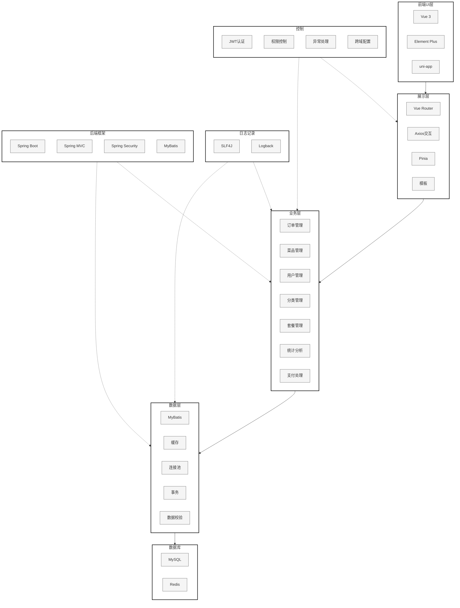

### 架构说明

**分层结构（从上到下）：**

1. **前端UI层**：用户界面展示
   - Vue 3 + TypeScript：核心前端框架
   - Element Plus：管理后台UI组件库
   - uni-app：微信小程序框架
   - HTML/CSS：页面结构和样式

2. **展示层**：前端交互和状态管理
   - Vue Router：路由管理
   - Axios：HTTP请求和Ajax交互
   - Pinia：全局状态管理
   - 模板渲染：页面模板处理

3. **业务层**：核心业务逻辑处理
   - 订单管理：订单创建、查询、状态管理
   - 菜品管理：菜品CRUD、口味管理
   - 用户管理：用户注册、登录、信息管理
   - 分类管理：菜品和套餐分类
   - 套餐管理：套餐CRUD、套餐菜品关联
   - 统计分析：数据统计、报表生成
   - 支付处理：微信支付集成、支付回调

4. **数据层**：数据访问和缓存
   - MyBatis Mapper：SQL映射和数据访问
   - Redis缓存：热点数据缓存、会话存储
   - Druid连接池：数据库连接管理
   - 事务管理：数据一致性保证
   - 数据校验：参数校验、数据验证

5. **数据库层**：数据持久化存储
   - MySQL 8.0：主数据库，存储业务数据
   - Redis：缓存数据库，提升性能

**横切关注点（右侧垂直面板）：**

- **日志记录**：系统日志记录和追踪
  - SLF4J：日志门面
  - Logback：日志实现

- **控制**：系统控制和安全管理
  - JWT认证：Token身份验证
  - 权限控制：接口权限管理
  - 异常处理：全局异常捕获
  - 跨域配置：CORS跨域支持

- **后端框架**：核心技术框架
  - Spring Boot 2.7.3：应用框架
  - Spring MVC：Web框架
  - Spring Security：安全框架
  - MyBatis 2.2.0：ORM框架

## 详细技术架构

### 1. 前端管理端架构

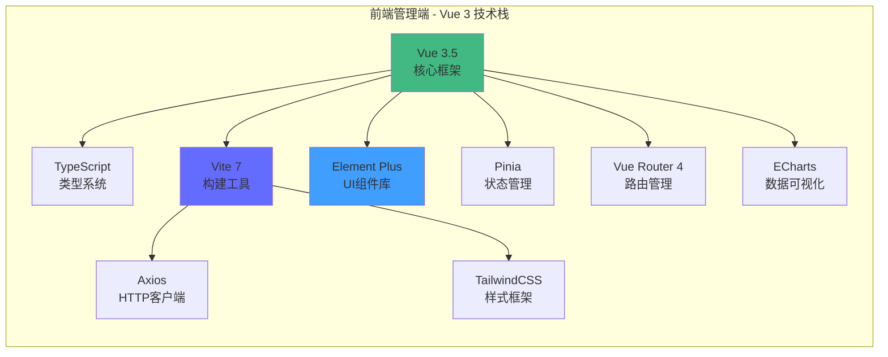

**技术栈详情：**
- **核心框架**：Vue 3.5.21 + Composition API
- **类型系统**：TypeScript 5.6.3
- **构建工具**：Vite 7.1.5
- **UI框架**：Element Plus 2.11.2
- **状态管理**：Pinia 3.0.3 + 持久化插件
- **路由管理**：Vue Router 4.5.1
- **HTTP客户端**：Axios 1.12.2
- **数据可视化**：ECharts 6.0.0
- **样式方案**：TailwindCSS 4.1.14 + SCSS
- **国际化**：Vue I18n 9.14.0
- **其他工具**：文件上传、Excel导出、二维码生成等

### 2. 后端服务架构

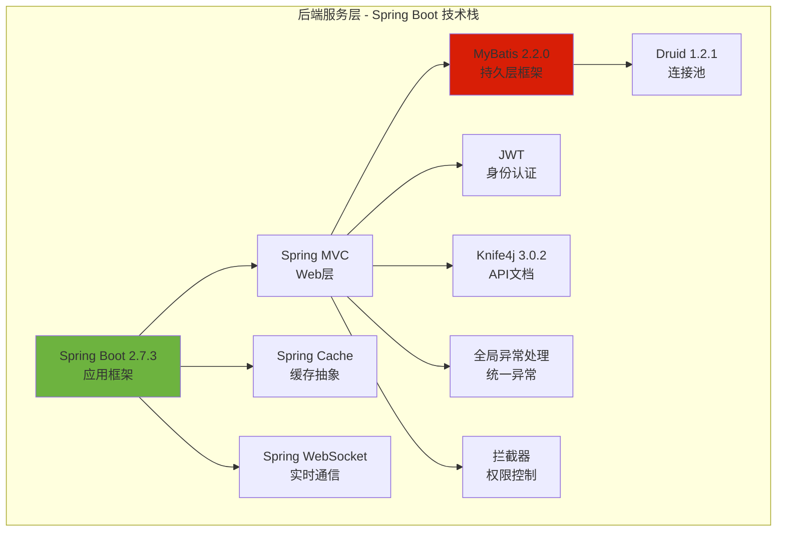

**技术栈详情：**
- **核心框架**：Spring Boot 2.7.3
- **Web框架**：Spring MVC
- **持久层**：MyBatis 2.2.0 + PageHelper分页
- **数据库连接池**：Druid 1.2.1（支持监控）
- **缓存**：Spring Cache + Redis
- **实时通信**：Spring WebSocket
- **身份认证**：JWT (jjwt 0.9.1)
- **API文档**：Knife4j 3.0.2 (Swagger增强版)
- **工具类**：Lombok、FastJSON、Apache POI
- **AOP**：AspectJ（自动填充创建人/修改人）

### 3. 微信小程序架构

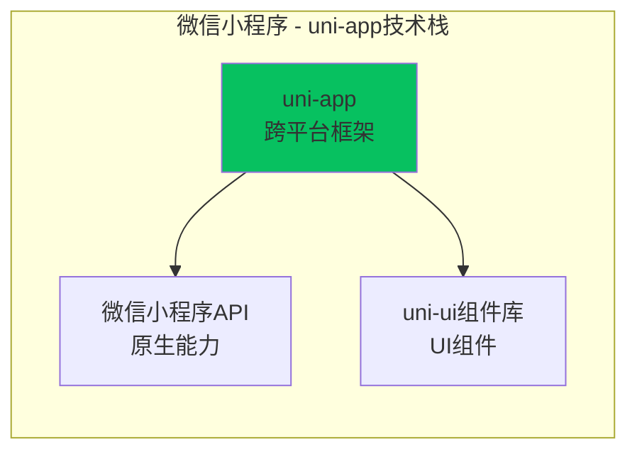

**技术栈详情：**
- **框架**：uni-app
- **平台**：微信小程序
- **UI组件**：uni-ui组件库
- **功能模块**：首页、商品详情、购物车、订单、地址管理、个人中心等

### 4. 数据层架构

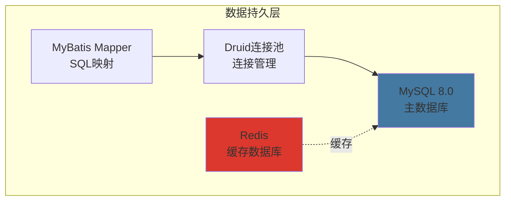

**数据库设计：**
- **主数据库**：MySQL 8.0
- **缓存数据库**：Redis
- **核心表结构**：
  - 员工表（EMPLOYEE）
  - 用户表（USER）
  - 分类表（CATEGORY）
  - 菜品表（DISH）
  - 菜品口味表（DISH_FLAVOR）
  - 套餐表（SETMEAL）
  - 套餐菜品关联表（SETMEAL_DISH）
  - 购物车表（SHOPPING_CART）
  - 订单表（ORDERS）
  - 订单明细表（ORDER_DETAIL）
  - 地址簿表（ADDRESS_BOOK）

### 5. 项目模块结构

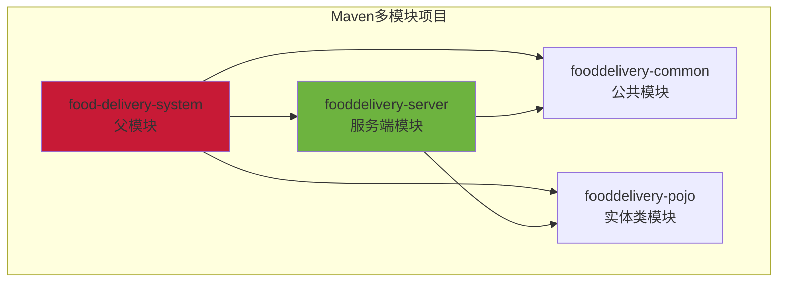

**模块说明：**
- **food-delivery-system**：父模块，统一管理依赖版本
- **fooddelivery-common**：公共工具类、常量、异常等
- **fooddelivery-pojo**：实体类、DTO、VO等数据传输对象
- **fooddelivery-server**：服务端主模块，包含Controller、Service、Mapper等

### 6. 系统分层架构

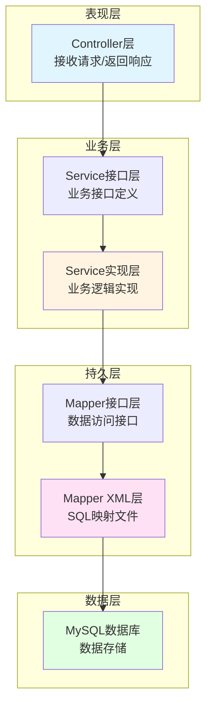

**分层说明：**
- **Controller层**：处理HTTP请求，参数校验，调用Service
- **Service层**：业务逻辑处理，事务管理
- **Mapper层**：数据访问，SQL执行
- **Entity层**：实体类，对应数据库表

### 7. 安全与认证架构

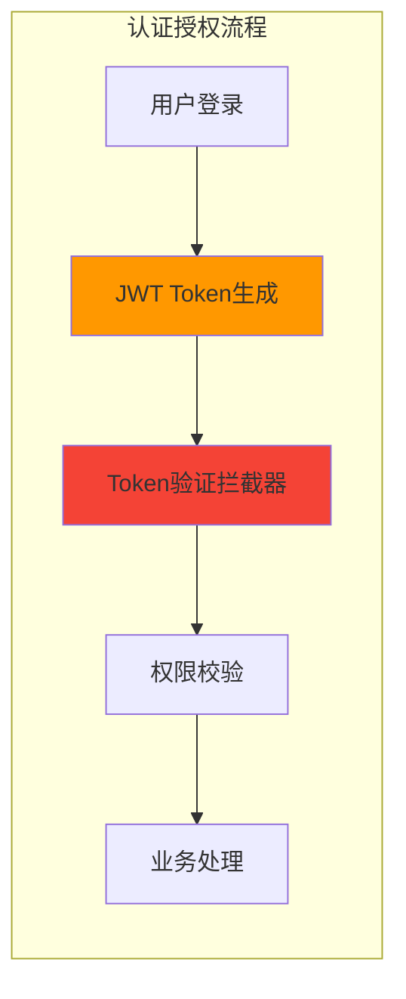

**安全机制：**
- **JWT认证**：管理员和用户分别使用不同的Token
- **拦截器**：
  - `JwtTokenAdminInterceptor`：管理员接口拦截
  - `JwtTokenUserInterceptor`：用户接口拦截
- **跨域配置**：CORS支持
- **密码加密**：MD5加密存储

### 8. 实时通信架构

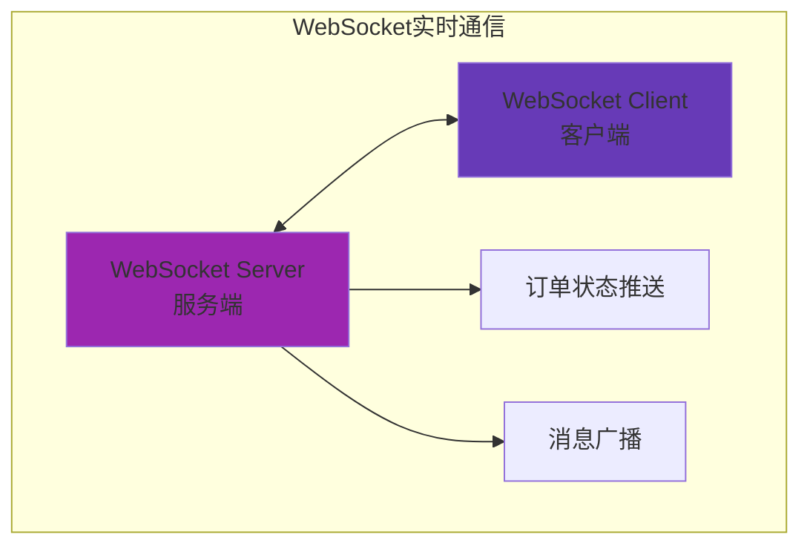

**实时通信功能：**
- **订单状态推送**：订单状态变更实时通知
- **消息广播**：系统消息推送
- **定时任务**：订单超时处理等

### 9. 外部服务集成

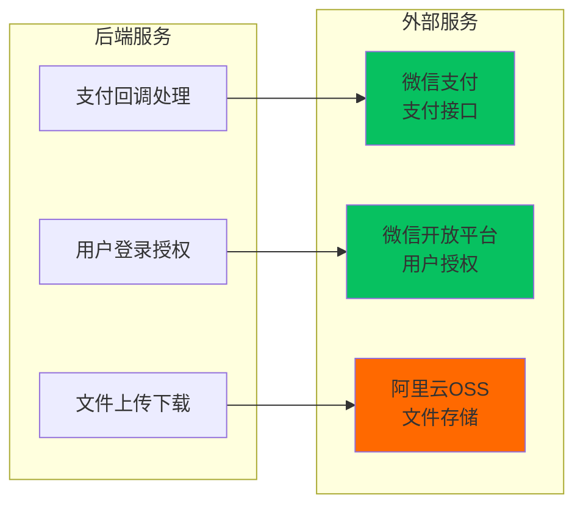

**外部服务：**
- **微信支付**：订单支付、支付回调处理
- **微信开放平台**：小程序用户授权登录
- **阿里云OSS**：图片、文件存储（可选）

## 技术选型总结

### 前端技术栈
| 技术 | 版本 | 用途 |
|------|------|------|
| Vue | 3.5.21 | 核心框架 |
| TypeScript | 5.6.3 | 类型系统 |
| Vite | 7.1.5 | 构建工具 |
| Element Plus | 2.11.2 | UI组件库 |
| Pinia | 3.0.3 | 状态管理 |
| Vue Router | 4.5.1 | 路由管理 |
| Axios | 1.12.2 | HTTP客户端 |
| ECharts | 6.0.0 | 数据可视化 |

### 后端技术栈
| 技术 | 版本 | 用途 |
|------|------|------|
| Spring Boot | 2.7.3 | 应用框架 |
| MyBatis | 2.2.0 | ORM框架 |
| MySQL | 8.0 | 关系型数据库 |
| Redis | - | 缓存数据库 |
| Druid | 1.2.1 | 数据库连接池 |
| JWT | 0.9.1 | 身份认证 |
| Knife4j | 3.0.2 | API文档 |
| WebSocket | - | 实时通信 |

### 开发工具
| 工具 | 用途 |
|------|------|
| Maven | 项目构建和依赖管理 |
| Git | 版本控制 |
| IDE | IntelliJ IDEA / VS Code |
| Postman | API测试 |
| Navicat | 数据库管理 |

## 部署架构

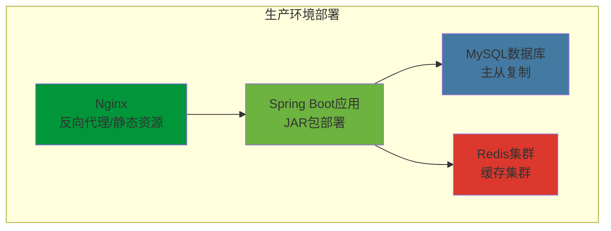

**部署说明：**
- **前端**：Nginx部署静态资源，支持反向代理
- **后端**：Spring Boot打包成JAR，使用内嵌Tomcat
- **数据库**：MySQL主从复制，保证高可用
- **缓存**：Redis集群，提升性能

## 系统特点

1. **前后端分离**：Vue 3 + Spring Boot，职责清晰
2. **多端支持**：管理后台 + 微信小程序
3. **模块化设计**：Maven多模块，便于维护
4. **安全可靠**：JWT认证 + 权限控制
5. **高性能**：Redis缓存 + 连接池优化
6. **实时通信**：WebSocket支持订单状态推送
7. **完善的文档**：Knife4j自动生成API文档
8. **易于扩展**：分层架构，便于功能扩展

