# 云味道外卖系统 - 数据库实体属性图（ERD）

## 完整ERD图

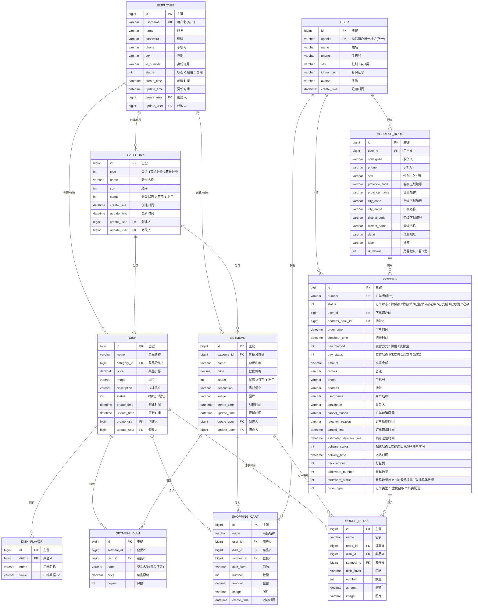

## 实体说明

### 1. 员工表 (EMPLOYEE)
- **用途**: 存储后台管理系统员工信息
- **主键**: id
- **唯一键**: username
- **关键字段**: username, password, status

### 2. 用户表 (USER)
- **用途**: 存储C端用户（微信小程序用户）信息
- **主键**: id
- **唯一键**: openid
- **关键字段**: openid, name, phone

### 3. 分类表 (CATEGORY)
- **用途**: 存储菜品分类和套餐分类
- **主键**: id
- **关键字段**: type (1:菜品分类, 2:套餐分类), name, status

### 4. 菜品表 (DISH)
- **用途**: 存储菜品基本信息
- **主键**: id
- **外键**: category_id → CATEGORY.id
- **关键字段**: name, category_id, price, status

### 5. 菜品口味表 (DISH_FLAVOR)
- **用途**: 存储菜品的口味选项（如：辣度、甜度等）
- **主键**: id
- **外键**: dish_id → DISH.id
- **关键字段**: dish_id, name, value

### 6. 套餐表 (SETMEAL)
- **用途**: 存储套餐基本信息
- **主键**: id
- **外键**: category_id → CATEGORY.id
- **关键字段**: name, category_id, price, status

### 7. 套餐菜品关系表 (SETMEAL_DISH)
- **用途**: 存储套餐包含的菜品信息（多对多关系）
- **主键**: id
- **外键**: setmeal_id → SETMEAL.id, dish_id → DISH.id
- **关键字段**: setmeal_id, dish_id, copies

### 8. 购物车表 (SHOPPING_CART)
- **用途**: 存储用户购物车中的商品信息
- **主键**: id
- **外键**: user_id → USER.id, dish_id → DISH.id, setmeal_id → SETMEAL.id
- **关键字段**: user_id, dish_id/setmeal_id, number, amount

### 9. 订单表 (ORDERS)
- **用途**: 存储订单主信息
- **主键**: id
- **唯一键**: number
- **外键**: user_id → USER.id, address_book_id → ADDRESS_BOOK.id
- **关键字段**: number, status, user_id, amount, pay_status

### 10. 订单明细表 (ORDER_DETAIL)
- **用途**: 存储订单中的商品明细
- **主键**: id
- **外键**: order_id → ORDERS.id, dish_id → DISH.id, setmeal_id → SETMEAL.id
- **关键字段**: order_id, dish_id/setmeal_id, number, amount

### 11. 地址簿表 (ADDRESS_BOOK)
- **用途**: 存储用户的收货地址信息
- **主键**: id
- **外键**: user_id → USER.id
- **关键字段**: user_id, consignee, phone, detail, is_default

## 关系说明

1. **员工 ↔ 分类/菜品/套餐**: 一对多关系，员工可以创建和修改分类、菜品、套餐
2. **分类 ↔ 菜品**: 一对多关系，一个分类可以包含多个菜品
3. **分类 ↔ 套餐**: 一对多关系，一个分类可以包含多个套餐
4. **菜品 ↔ 菜品口味**: 一对多关系，一个菜品可以有多个口味选项
5. **套餐 ↔ 套餐菜品关系**: 一对多关系，一个套餐可以包含多个菜品
6. **用户 ↔ 地址簿**: 一对多关系，一个用户可以有多个收货地址
7. **用户 ↔ 购物车**: 一对多关系，一个用户可以有多个购物车项
8. **用户 ↔ 订单**: 一对多关系，一个用户可以下多个订单
9. **地址簿 ↔ 订单**: 一对多关系，一个地址可以被多个订单使用
10. **订单 ↔ 订单明细**: 一对多关系，一个订单可以包含多个订单明细

---

## 单个实体详细属性图

### 1. 菜品实体 (DISH) 属性图

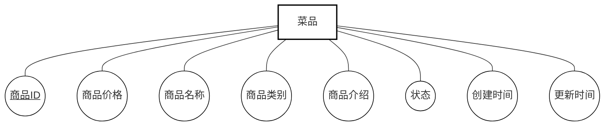

### 2. 分类实体 (CATEGORY) 属性图

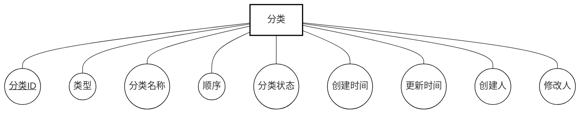

### 3. 员工实体 (EMPLOYEE) 属性图

### 4. 用户实体 (USER) 属性图

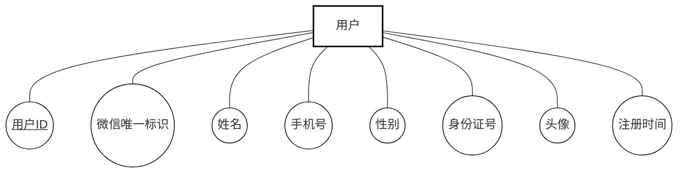

### 5. 订单实体 (ORDERS) 属性图

```mermaid
flowchart TD
    ORDERS[订单]
    
    ORDERS --- ID((<u>订单ID</u>))
    ORDERS --- NUMBER((订单号))
    ORDERS --- STATUS((订单状态))
    ORDERS --- USER_ID((下单用户ID))
    ORDERS --- ADDRESS_BOOK_ID((地址ID))
    ORDERS --- ORDER_TIME((下单时间))
    ORDERS --- CHECKOUT_TIME((结账时间))
    ORDERS --- PAY_METHOD((支付方式))
    ORDERS --- PAY_STATUS((支付状态))
    ORDERS --- AMOUNT((实收金额))
    ORDERS --- REMARK((备注))
    ORDERS --- PHONE((手机号))
    ORDERS --- ADDRESS((地址))
    ORDERS --- USER_NAME((用户名称))
    ORDERS --- CONSIGNEE((收货人))
    ORDERS --- ORDER_TYPE((订单类型))
    ORDERS --- DELIVERY_TIME((送达时间))
    
    style ORDERS fill:#ffffff,stroke:#000000,stroke-width:2px
    style ID fill:#ffffff,stroke:#000000,stroke-width:1px
    style NUMBER fill:#ffffff,stroke:#000000,stroke-width:1px
    style STATUS fill:#ffffff,stroke:#000000,stroke-width:1px
    style USER_ID fill:#ffffff,stroke:#000000,stroke-width:1px
    style ADDRESS_BOOK_ID fill:#ffffff,stroke:#000000,stroke-width:1px
    style ORDER_TIME fill:#ffffff,stroke:#000000,stroke-width:1px
    style CHECKOUT_TIME fill:#ffffff,stroke:#000000,stroke-width:1px
    style PAY_METHOD fill:#ffffff,stroke:#000000,stroke-width:1px
    style PAY_STATUS fill:#ffffff,stroke:#000000,stroke-width:1px
    style AMOUNT fill:#ffffff,stroke:#000000,stroke-width:1px
    style REMARK fill:#ffffff,stroke:#000000,stroke-width:1px
    style PHONE fill:#ffffff,stroke:#000000,stroke-width:1px
    style ADDRESS fill:#ffffff,stroke:#000000,stroke-width:1px
    style USER_NAME fill:#ffffff,stroke:#000000,stroke-width:1px
    style CONSIGNEE fill:#ffffff,stroke:#000000,stroke-width:1px
    style ORDER_TYPE fill:#ffffff,stroke:#000000,stroke-width:1px
    style DELIVERY_TIME fill:#ffffff,stroke:#000000,stroke-width:1px
```

### 6. 套餐实体 (SETMEAL) 属性图

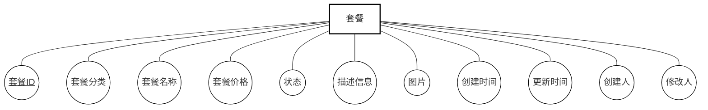

### 7. 地址簿实体 (ADDRESS_BOOK) 属性图

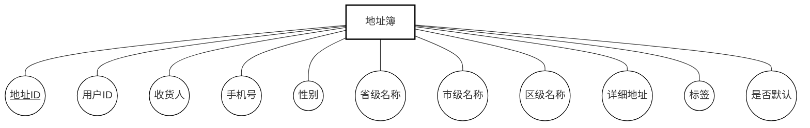

### 8. 购物车实体 (SHOPPING_CART) 属性图

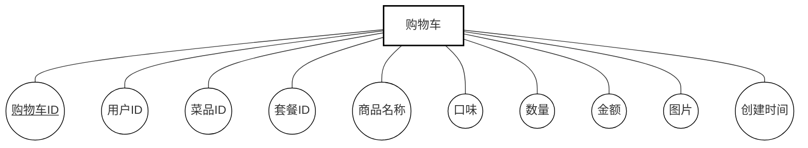

### 9. 订单明细实体 (ORDER_DETAIL) 属性图

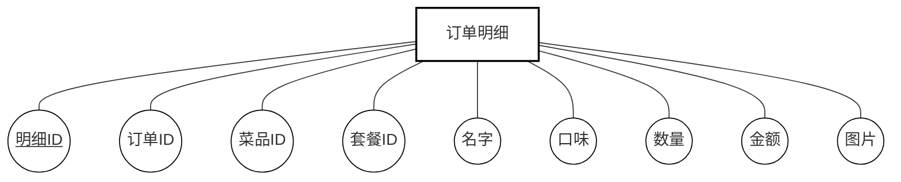

### 10. 菜品口味实体 (DISH_FLAVOR) 属性图

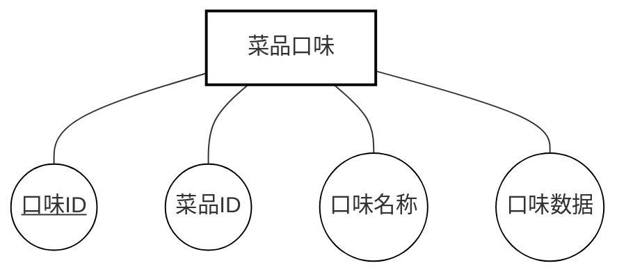

### 11. 套餐菜品关系实体 (SETMEAL_DISH) 属性图

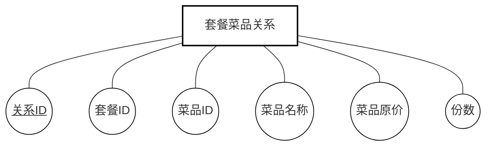

## 图例说明

- **矩形框**: 实体名称（居中显示）
- **椭圆形**: 属性名称
- **下划线**: 主键属性（Primary Key）
- **直线连接**: 表示实体与属性之间的关系

